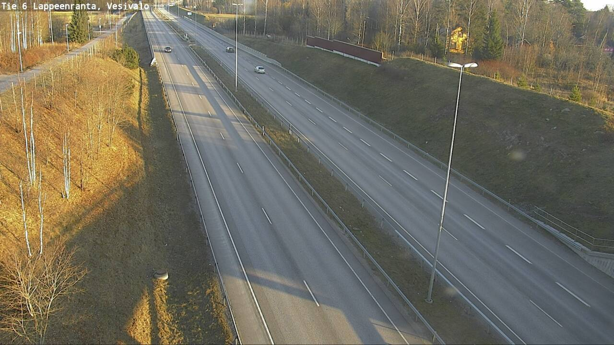
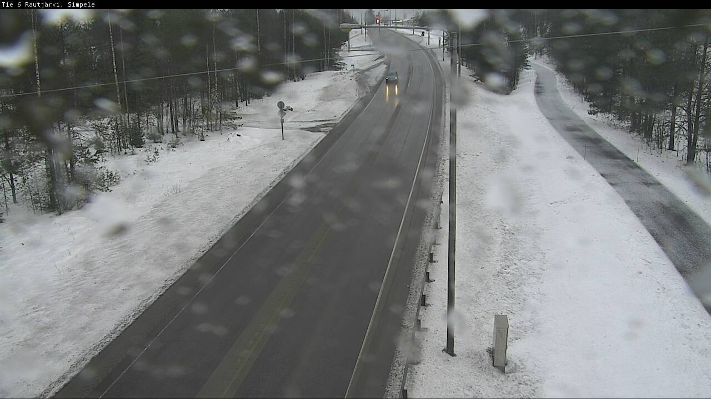
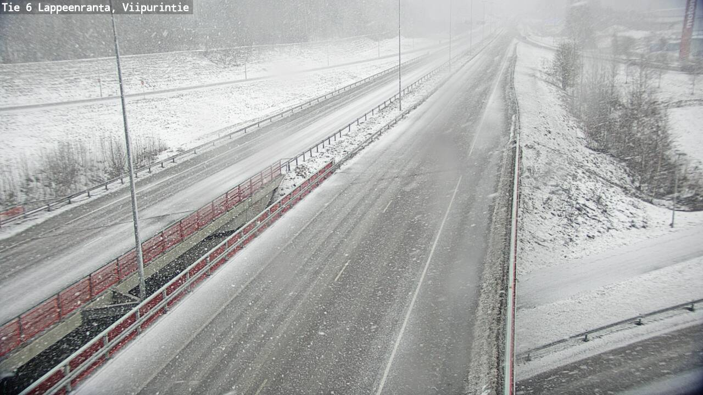
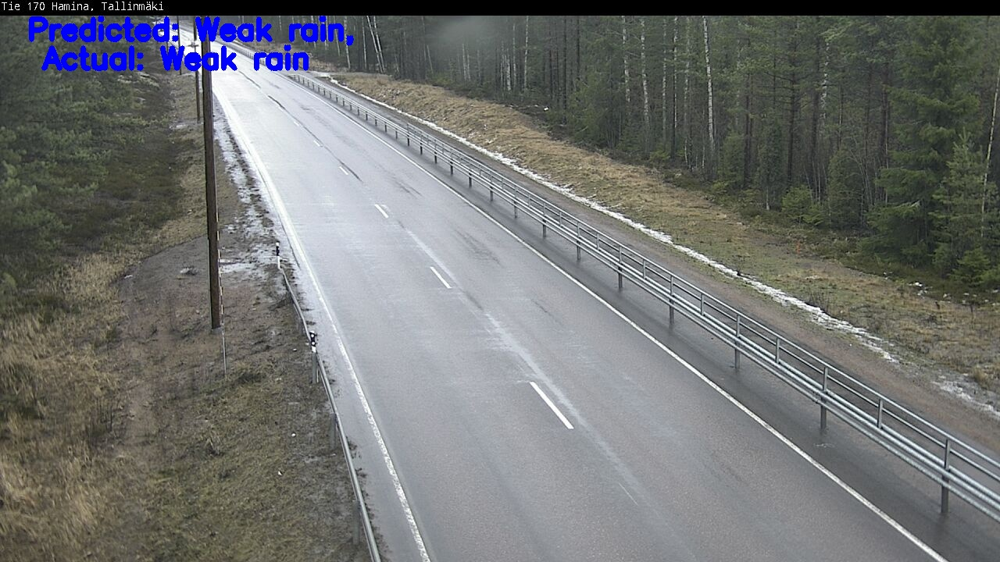
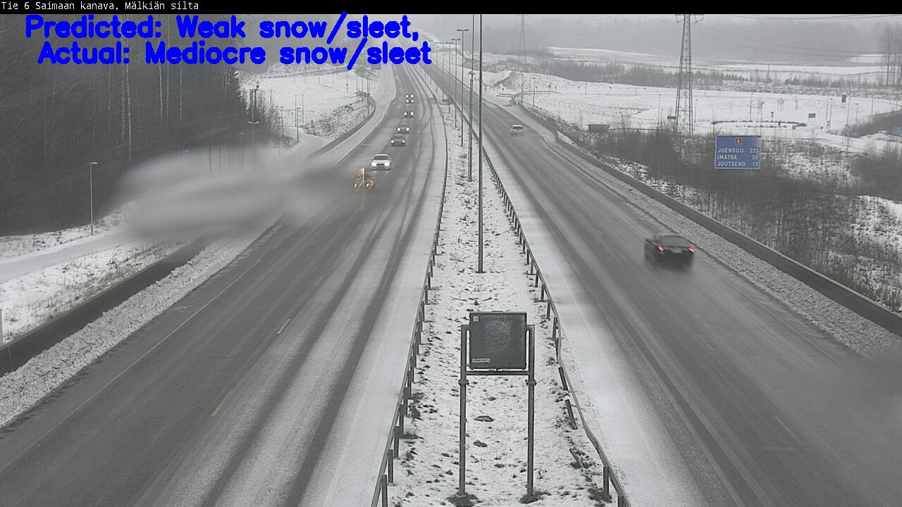
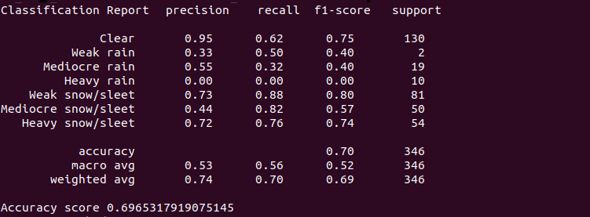

Prepare and develop end-to-end pipeline for a weather conditions classification light-weight neural network.

As an input this model should take a video sequence from CCTV camera; 
As an output model should classify weather conditions (Clear, Rain, Snow). 

Network should be light enough to run in realtime on a Jetson Nano device.

Detailed description can be found in **page2** in *'AM-Traffic I. Phase 2. Iteration 2 task4.pdf'* file.

-------------------------------------------------------------------------------------------------------------------------------
# Requirements
To be able to install Fastai on Valohai, part of the requirements could be found in *requirements.txt* and you can find the rest of them in the yaml file instructions.

For a normal environment Fastai setup: (Or visit https://docs.fast.ai/install.html )
```sh
python3.6 -m pip install torch==1.4.0
python3.6 -m pip install fastai==1.0.60
```
For Fastai installation on Valohai : (Or check the Yaml file)
Use the image:
```sh
pytorch/pytorch:1.3-cuda10.1-cudnn7-runtime
```
```sh
conda install -y numpy
conda install -c fastai fastai
conda install -y --file requirements.txt
```
# Data
The data was collected during task4. As described in task4, the images were downloaded in AWS S3 bucket and the labels are included in the images’s names whose format is as follows:<br/>
 *'camera-id'\_r'roadConditionCategory'\_w'weatherConditionCategory'\_'measuredTime'*<br/>
 eg. "C1255201_r7_w0_2020-01-29_21-00-39"<br/>
 The weather conditions to classify are:<br/>
 1. Clear (0)
 2. Raining, three scales:
      * Weak rain (1)
      * Mediocre rain (2)
      * Heavy rain (3)
  3. Snowing, three scales:
      * Weak snow/sleet (4)
      * Mediocre snow/sleet (5)
      * Heavy snow/sleet (6)
      
<p align="center">
  
   
  
</p>

**PS**: For 'Rain' and 'Snow', the condition of weather is based on the degree (Weak/Mediocre/Heavy) of Snowfall/Rainfall present in the image. 

Unfortunately the labels are not accurate and have many mistakes and that’s due to different reasons such as the quality of the image, the distance between camera and weather station, sensors errors… so manually checking the labels was necessary. Besides, some categories (like mediocre rain) don’t exist in the collected dataset and some others have small amount of images. That’s why extra data from other cctv cameras was fed to the model. The sources of the added data could be found in ‘added_data.txt’ file.
# Training the model (train.py)
The training was made using **1xGPU NVIDIA Tesla K80** (on Microsoft Azure NC6).

Once the data was ready, a model was built with Fastai (Pytorch). I used the resnet34 architecture pretrained on imagenet dataset. The choice of the architecture was based on the fact that the model must be light weighted in order to be run in realtime on a Jetson Nano device. Therefore, I had to make a compromise between accuracy and lesser number of parameters. Since depth-wise convolutions are known of low accuracy, I didn’t opt for mobilenet. So I found that resnet34 is the best candidate.<br/>  
The data was augmented using Fastai library.<br/>

The best accuracy obtained is **0.97** (execution **#31** in Valohai).
This model was obtained with one cycle policy, batch size of *64* samples, image with *(224x224)* size and no layer fine tuned.
# Testing the model (predict.py)
To test the performance of the model we run the model on images not included in training and validation datasets.
## Prediction on images
You can make predictions on images following these steps:
1. Download *WeatherRoad_EvaluationDataset.zip* from [here](https://drive.google.com/open?id=1MDuIcb1pNqmTAYhkhY_5IegAgPL0dnkH) and extract it to the root folder. (Use weather folder for the testing)
2. Download Model weights from [here](https://drive.google.com/open?id=1LcW1wH_Pq99LD4IPMqow0DjVVFk-lPwn) and put it in the *models* folder in the root folder.
3. In the root folder create the output directory **output_weather_torch**.
4. From the root folder execute:
    ```sh
    python3 predict_images_torch.py --model ./models/weather_model.pt --weights  ./models/weights_weather.pth --input ./WeatherRoad_EvaluationDataset/weather --output ./output_weather_torch --output ./output_weather_torch --labels ./weather_labels.json
    ```
    Where:
    * **'model'**: the path of the training model architecture.
    * **weights**: the path to the parameters of the model.
    * **'input'**: the path of your input images.
    * **'output'**: the path of the output images.
    * **'labels'**: the path of labels json file.
4. Check annotated images in /output_weather_torch folder and network metrics in the terminal window.

### Results
The predictions are displayed on images as follows:

<p align="center">
  
</p>

<p align="center">
  
</p>

Predictions metrics calculated on the test dataset:

<p align="center">
  
</p>

## Prediction on video
You can make predictions on video following these steps:
1. Download the test video **test_video.mp4** from [here]() and put it in the root folder.
2. Download Model weights from [here](https://drive.google.com/open?id=1LcW1wH_Pq99LD4IPMqow0DjVVFk-lPwn) and put it in the **models** folder in the root folder.
3. In the root folder create the output directory **output_weather_torch**.
4. From the root folder execute:
```sh
python3 predict_video_torch.py --model ./models/pytorch/weather_model.pt --weights  ./models/pytorch/weights_weather.pth --input ./test_video.mp4 --labels ./weather_labels.json --output output_weather_torch/weather_conditions.avi --size 1
```
Where:
* **'model'**: the path of the training model.
* **weights**: the path to the parameters of the model.
* **'input'**: the path of your input vdeo (you have to mention the input video name).
* **'output'**: the path of the output video (you have to mention the output video name).
* **'labels'**: the path of labels json file.
* **'size'**: size of queue for averaging (128 by default). Set the size to 1 if you  don't want to perform any averaging.

# Conversion to TensorRT
Conversion of the built pytorch model to ONNX model to TensorRT model.
## Requirement
* tensorflow-gp~=1.15.0
* Keras~=2.2.5
* argparse~=1.4.0
* onnx2keras~=0.018
* onnx~=1.6.0
* torch~=1.4.0
## Installation
```sh
pip3 install onnx
pip3 install onnx2keras
git clone https://github.com/onnx/onnx-tensorflow.git
cd onnx-tensorflow
sudo python3 setup.py install
```
## Conversion from pytorch model to keras model
Use the script *convert_pt_to_keras.py* as follows:
```sh
python3 convert_pt_to_keras.py --model ./models/torch/weather_model.pt --weights ./models/torch/weights_weather.pth --keras_path ./models/torch_trt/
```
Where:
* **model**: path to trained serialized model.
* **weights**: path to the parameters of the model.
* **keras_path**: path where to save our converted keras model.

Once the script in executed, onnx model and keras model are saved in *keras_path*.
## conversion from keras model to tensorRT model
Use the script *convert_keras_to_trt.py* as follows:
```sh
python3 convert_keras_to_trt.py --trt_path ./models/keras_trt --model ./models/tensorflow/weather_model.h5 --output_node  test_output/BiasAdd
```
Where:
* **trt_path**: path where to save the converted models.
* **model**: path to trained serialized keras model.
* **output_node**:  name of the output node (*test_output/BiasAdd* in our case).

After running this script successfully, in trt_path you will have:
*checkpoints, tf_model.meta, frozen_model.pb and tensorrt_model.pb.*

# Inference on Jetson Nano
After converting the models to TensorRT we can make inferences on Jetson Nano following these instructions:
1. Setup Jetson Nano:
```sh
sudo apt update
sudo apt install python3-pip libhdf5-serial-dev hdf5-tools
pip3 install --extra-index-url https://developer.download.nvidia.com/compute/redist/jp/v43 tensorflow-gpu==1.15.0+nv20.1
pip3 install pillow
```
2. Download zip file that contains TRT weights from [here](https://drive.google.com/open?id=1Ontame0VWgJU-z0oYC1g2JEcahYkJk1W).
3. Unzip the zip file.
4. Choose the appropriate TRT weights that you will use and upload it on Jetson Nano.

   PS:
   * **w_** refers to weather classification.
   * **r_** refers to road classification.
   * **pt_** means that this model was trained using 'Pytorch'.
   * **tf_** means that this model was trained using 'Tensorflow'.
   * **16** and **32** refer to 'Foating Point Precision' type.
5. Choose an image you want to predict and upload it on the same directory as the model and the prediction script **predict_trt.py**.
6. From the folder where files are uploaded execute:
   ```sh
   python3 predict_trt.py --input_node test_input --output_node test_output/BiasAdd --path w_pt_32_tensorrt_model.pb --img_path img0.jpg --labels weather_labels.json --shape_size 224 --time true
   ```
   
   Where:
     * **'input_node'**: name of the input node.
     * **'output_node'**: name of the output node.
     * **'path'**: path to the trt model.
     * **'img_path'**: path to the image we want to predict.
     * **'labels'**: the path of labels json file.
     * **'shape_size'**: input shape (height).
     * **'shape_size'**: set it to True if you want to compute the execution time and fps.
     
   ## Results
   For model with 'Foating Point Precision' equal to 32 the **average(sec/frame)** varies from 0.17 to 0.19 and the **fps** varies from 5.28 to 5.59.
   
   For model with 'Foating Point Precision' equal to 16 the **average(sec/frame)** is 0.17 and the **fps** varies from 5.88 to 5.61.
   
   **PS**: Unfortunately the conversion from Pytorch to ONNX to TRT affects the model accuracy.
